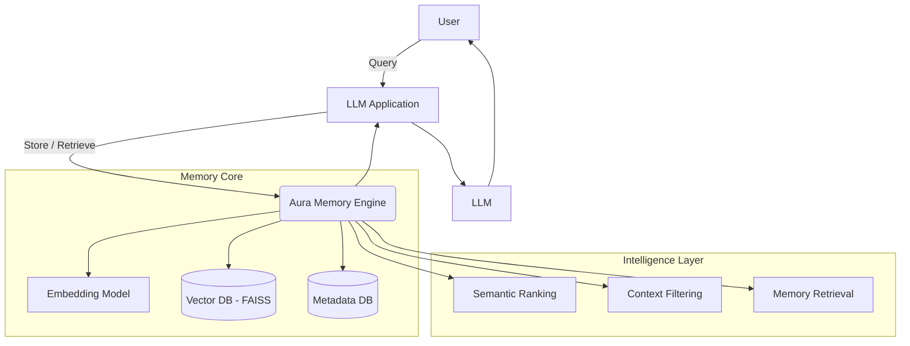

# 🧠 Aura AI Memory Engine  
### Persistent Memory System for LLM Applications

A high-performance, long-term memory engine for AI agents, designed to enable context retention, semantic recall, and intelligent retrieval across sessions.

Built with a local-first architecture, Aura transforms stateless LLMs into stateful, context-aware systems capable of reasoning over historical interactions.

---

## 🚀 Why This Exists

Most LLMs are:
- Stateless  
- Forget past interactions  
- Limited by context window  

Aura fixes this by introducing:
- Persistent memory  
- Semantic retrieval  
- Context-aware reasoning  

---

## 🏗️ Architecture Overview



---

## ✨ Core Features

### 🧠 Long-Term Memory
- Stores interactions across sessions  
- Enables context continuity  

### ⚡ Semantic Search
- Embedding-based retrieval  
- Meaning-based recall  

### 🧩 Context Injection
- Injects relevant memory into prompts  
- Improves LLM accuracy  

### 🔄 Continuous Updates
- Learns from new interactions  
- Evolves over time  

### 🛡️ Local-First
- No external APIs required  
- Fully private and cost-efficient  

---

## ⚙️ How It Works

1. Store → Convert text to embeddings  
2. Retrieve → Similarity search  
3. Rank → Select relevant memory  
4. Inject → Pass into LLM  

---

## 🛠️ Tech Stack

| Layer | Technology |
|------|-----------|
| Embeddings | Sentence-Transformers |
| Vector DB | FAISS |
| Backend | Python |
| Storage | SQLite / JSON |
| LLM | Ollama / OpenAI |

---

## 🛠️ Installation

```bash
git clone https://github.com/itsmeakshay0510/Aura-ai-memory-engine.git
cd Aura-ai-memory-engine

python -m venv venv
source venv/bin/activate

pip install -r requirements.txt
```

---

## ▶️ Usage

```python
from aura_memory import MemoryEngine

memory = MemoryEngine()

memory.add("User is building an AI startup")

context = memory.search("What is the user working on?")
print(context)
```

---

## 📈 Highlights

- Fast retrieval with FAISS  
- Reduced token usage  
- Better response quality  
- Scalable memory system  

---

## 👤 Author

Akshay Raj  
AI Engineer | LLM Systems
